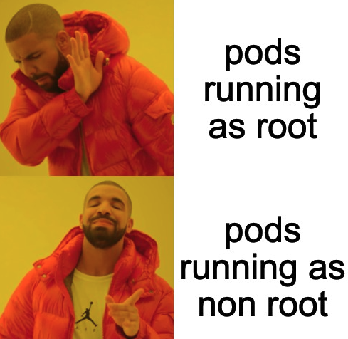

# Context Guardian

Focuses on the role of protecting the security context. This is taken from the point of view of creating your first Pepr module.


## Table of Contents

- [Introduction](#introduction)
- [Initialization](#initialization)
- [Security Context Logic](#security-context-logic)
- [Buuld](#build)
- [Usage](#usage)

## Introduction

The context guardian has one role - **protect the security context of pods in the cluster**. It does this by ensuring that the security context of the pod meets a guaranteed security threshold. The context guardian has a mutating admission webhook that intercepts all pod creation requests and ensures that the security context is defined. If the security context is not defined, the context guardian will inject the security context into the pod definition. The context guardian will also ensure that the security context meets the minimum security threshold. If the security context does not meet the minimum security threshold, the context guardian will reject the pod creation request.



## Initialization

To start this project, you will need to have the following installed:
- [Node.js](https://github.com/defenseunicorns/pepr?tab=readme-ov-file#prerequisites)
- [npm](https://github.com/defenseunicorns/pepr?tab=readme-ov-file#prerequisites)
- [kubectl](https://kubernetes.io/docs/tasks/tools/#kubectl)
- [k3d](https://k3d.io/v5.6.3/#releases) (or another ephemeral cluster for testing)


Initialize the project by running the following command `npx pepr init`:

```bash
?> npx pepr init 

✔ Enter a name for the new Pepr module. This will create a new directory based on the name.

context-guardian

✔ (Recommended) Enter a description for the new Pepr module.

✔ How do you want Pepr to handle errors encountered during K8s operations?

Reject the operation # do not allow objects into the cluster if there is an error or the webhook is unresponsive
```

That is it, we have now scaffolded our admission webhook project.

## Security Context Logic

The context guardian will ensure that the security context of the pod meets the minimum security threshold, however, it does not intend to overwrite the security context of the pod should it already exist.

In our mutating webhook pod logic, we will check if the security context is defined. If the security context is not defined, we will inject the security context into the pod definition. If the security context is defined we will leave it alone and the pod will be sent to the validation webhook.

Go to the newly created `context-guadian` directory and open the `capabilities` directory. We will add a new file called `security-context.ts` to keep our security context logic.

```typescript
import {
  Capability
} from "pepr";


export const ContextGuardian = new Capability({
  name: "context-guardian",
  description: "Focuses on the role of protecting the security context",
});


const { When } = ContextGuardian;
```

Notice the `Capability` does not have the namespaces array defined. This is because we will focus on **all namespaces across the cluster**.


Now lets focus on the logic to mutate pods without security contexts defined. Import `a` and `sdk` from Pepr before proceeding.

```typescript
const { containers } = sdk;

When(a.Pod)
  .IsCreatedOrUpdated()
  .Mutate(request => {
    const pod = request.Raw.spec!;
    const metadata = request.Raw.metadata || {};

    // Ensure the securityContext field is defined
    pod.securityContext = pod.securityContext || {};

    // Set the runAsUser field if it is defined in a label
    const runAsUser = metadata.labels?.["uds/user"];
    if (runAsUser) {
      pod.securityContext.runAsUser = parseInt(runAsUser);
    }

    // Set the runAsGroup field if it is defined in a label
    const runAsGroup = metadata.labels?.["uds/group"];
    if (runAsGroup) {
      pod.securityContext.runAsGroup = parseInt(runAsGroup);
    }

    // Set the fsGroup field if it is defined in a label
    const fsGroup = metadata.labels?.["uds/fsgroup"];
    if (fsGroup) {
      pod.securityContext.fsGroup = parseInt(fsGroup);
    }

    // Set the runAsNonRoot field to true if it is undefined
    if (pod.securityContext.runAsNonRoot === undefined) {
      pod.securityContext.runAsNonRoot = true;
    }

    // Set the runAsUser field to 1000 if it is undefined
    if (pod.securityContext.runAsUser === undefined) {
      pod.securityContext.runAsUser = 1000;
    }

    // Set the runAsGroup field to 1000 if it is undefined
    if (pod.securityContext.runAsGroup === undefined) {
      pod.securityContext.runAsGroup = 1000;
    }

    for (const container of containers(request)) {
      container.securityContext = container.securityContext || {};
      container.securityContext.capabilities =
        container.securityContext.capabilities || {};
      container.securityContext.capabilities.drop = ["ALL"];
      container.securityContext.allowPrivilegeEscalation = false;
      container.securityContext.privileged = false;
    }

    metadata.annotations["admission"] = "mutated-security-context";
  });

```

Notice we are not overwriting the security context if it is already defined. We are only injecting the security context if it is not defined. We are using the `containers` helper to drop all container security context capabilities.  We are also setting the `admission` annotation to `mutated-security-context` to indicate that the pod security context has been through the mutating webhook.

Now we need to add the security context validation logic. Import `V1SecurityContext` from "pepr" before proceeding.

```typescript
  .Validate(request => {
    const podCtx = request.Raw.spec?.securityContext || {};

    const isRoot = (ctx: Partial<V1SecurityContext>) => {
      const isRunAsRoot = ctx.runAsNonRoot === false;
      const isRunAsRootUser = ctx.runAsUser === 0;

      return isRunAsRoot || isRunAsRootUser;
    };

    if (isRoot(podCtx)) {
      return request.Deny(
        "Pod level securityContext does not meet the non-root user requirement.",
      );
    }

    return request.Approve();
  });
```

We are done. We have added the security context logic to the context guardian. The context guardian will now ensure that the security context of the pod and containers meet the minimum security threshold.

Finally update pepr.ts to import the `ContextGuardian` capability.

```typescript
import { PeprModule } from "pepr";
import cfg from "./package.json";

import { ContextGuardian } from "./capabilities/context-guardian";


new PeprModule(cfg, [ContextGuardian]);
```

## Build

Pepr make building your project easy. Run the following command to build the project:

```bash
?> npx pepr format # format the code
?> npx pepr build --rbac-mode=scoped

# output
....
✅ K8s resource for the module saved to /Users/cmwylie19/context-guardian/dist/pepr-module-3ac61b16-3bab-5a37-bbe9-f18335374d12.yaml
``` 

Admission Controllers do not require RBAC to do their job. The `--rbac-mode=scoped` flag will create a scoped RBAC policy for the module with least privilege access. We do not need extra RBAC because we are only mutating and validating pods.


## Usage

To use the context guardian, we need to deploy the module to the cluster. Create a cluster with the following command:

```bash
k3d cluster create
```

Apply the module to the cluster:

```bash
kubectl apply -f dist/pepr-module-3ac61b16-3bab-5a37-bbe9-f18335374d12.yaml
```

Test it out:

This pod has no security context defined. The context guardian will inject the security context into the pod definition.


```bash
kubectl apply -f test/no-context-pod.yaml
```

Now verify the mutating webhook has injected the security context into the pod definition:

```bash  
# kubectl get po no-context-pod -o jsonpath='{.spec.securityContext}'
kubectl get po no-context-pod -o jsonpath='{.spec.securityContext}'
{"runAsGroup":1000,"runAsNonRoot":true,"runAsUser":1000}

kubectl get po no-context-pod -o jsonpath='{.spec.containers[0].securityContext}' 
{"allowPrivilegeEscalation":false,"capabilities":{"drop":["ALL"]},"privileged":false}
```

This pod that runs as root will be rejected by the context guardian.

```bash
kubectl apply -f test/root-pod.yaml

# output
error from server: error when creating "test/root-pod.yaml": admission webhook "pepr-3ac61b16-3bab-5a37-bbe9-f18335374d12.pepr.dev" denied the request: Pod level securityContext does not meet the non-root user requirement
```

Congrats on your first module! 🎉

Some key considerations are:
- using `npx pepr dev` to develop and test your module before deploy
- add in more security constraints to the security context logic. This is just a simple demo.
